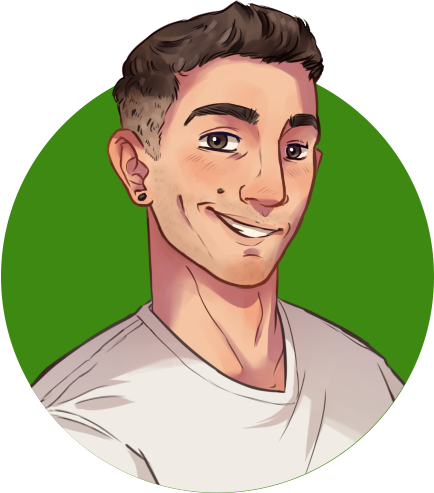

<!-- PROJECT SHIELDS -->
[![Forks][forks-shield]][forks-url]
[![Stargazers][stars-shield]][stars-url]
[![Issues][issues-shield]][issues-url]
[![LinkedIn][linkedin-shield]][linkedin-url]

<!-- PROJECT LOGO -->
<br />
<p align="center">
  <a href="https://github.com/tomimelo/tomasmelone">
    
  </a>

  <h3 align="center">Tomás Melone</h3>

  <p align="center">
    Welcome to my personal website!
    <br />
    <a href="https://github.com/tomimelo/tomasmelone"><strong>Explore the docs »</strong></a>
    <br />
    <br />
    <a href="https://www.tomasmelone.ml/">View Demo</a>
    ·
    <a href="https://github.com/tomimelo/tomasmelone/issues">Report Bug</a>
    ·
    <a href="https://github.com/tomimelo/tomasmelone/issues">Request Feature</a>
  </p>
</p>


<!-- TABLE OF CONTENTS -->
<details open="open">
  <summary><h2 style="display: inline-block">Table of Contents</h2></summary>
  <ol>
    <li>
      <a href="#about-the-project">About The Project</a>
      <ul>
        <li><a href="#built-with">Built With</a></li>
      </ul>
    </li>
    <li>
      <a href="#getting-started">Getting Started</a>
      <ul>
        <li><a href="#prerequisites">Prerequisites</a></li>
        <li><a href="#installation">Installation</a></li>
        <li><a href="#development-server">Development server</a></li>
        <li><a href="#build">Build</a></li>
      </ul>
    </li>
    <li><a href="#usage">Usage</a></li>
    <li><a href="#contact">Contact</a></li>
    <li><a href="#acknowledgements">Acknowledgements</a></li>
  </ol>
</details>


<!-- ABOUT THE PROJECT -->
## About The Project

[![Product Name Screen Shot][product-screenshot]](https://www.tomasmelone.ml/)

This is my personal website frontend made in Angular.
Thanks to Camila Nanni who helped me with the responsive design and Camila Melone for the awesome drawing of me!

### Built With

* [Angular 12+](https://angular.io/)


<!-- GETTING STARTED -->
## Getting Started

To get a local copy up and running follow these simple steps.

### Prerequisites

You will need a copy of [Node.js](https://nodejs.org/es/) as an environment to run the project. Then you need to use a dependency manager like npm to download dependencies into your project.

* npm
  ```sh
  npm install npm@latest -g
  ```

* Angular CLI
  ```sh
  npm install -g @angular/cli
  ```

* Typescript
  ```sh
  npm install -g typescript
  ```

### Installation

1. Clone the repo
   ```sh
   git clone https://github.com/tomimelo/tomasmelone.git
   ```
2. Install NPM packages
   ```sh
   npm install
   ```

### Development server

Run `ng serve` for a dev server. Navigate to `http://localhost:4200/`. The app will automatically reload if you change any of the source files.

### Build

Run `ng build` to build the project. The build artifacts will be stored in the `dist/` directory.

<!-- USAGE EXAMPLES -->
## Usage

Feel free to explore as you wish!

<!-- CONTACT -->
## Contact

[Tomás Melone](https://linkedin.com/in/tomasmelone)

Project Link: [https://github.com/tomimelo/tomasmelone](https://github.com/tomimelo/tomasmelone)

<!-- ACKNOWLEDGEMENTS -->
## Acknowledgements

* [Camila Nanni (UX/UI Designer)](https://www.linkedin.com/in/camilananni/)
* [Camila Melone (Digital artist)](https://www.instagram.com/almaa_bm/)
* [Iconify (codicons)](https://icon-sets.iconify.design/codicon/)
* [Boxicons](https://boxicons.com/)
* [README](https://github.com/othneildrew/Best-README-Template) template by @othneildrew


<!-- MARKDOWN LINKS & IMAGES -->
[forks-shield]: https://img.shields.io/github/forks/tomimelo/tomasmelone.svg?style=for-the-badge
[forks-url]: https://github.com/tomimelo/tomasmelone/network/members
[stars-shield]: https://img.shields.io/github/stars/tomimelo/tomasmelone.svg?style=for-the-badge
[stars-url]: https://github.com/tomimelo/tomasmelone/stargazers
[issues-shield]: https://img.shields.io/github/issues/tomimelo/tomasmelone.svg?style=for-the-badge
[issues-url]: https://github.com/tomimelo/tomasmelone/issues
[linkedin-shield]: https://img.shields.io/badge/-LinkedIn-black.svg?style=for-the-badge&logo=linkedin&colorB=555
[linkedin-url]: https://linkedin.com/in/tomasmelone
[product-screenshot]: images/screenshot.png